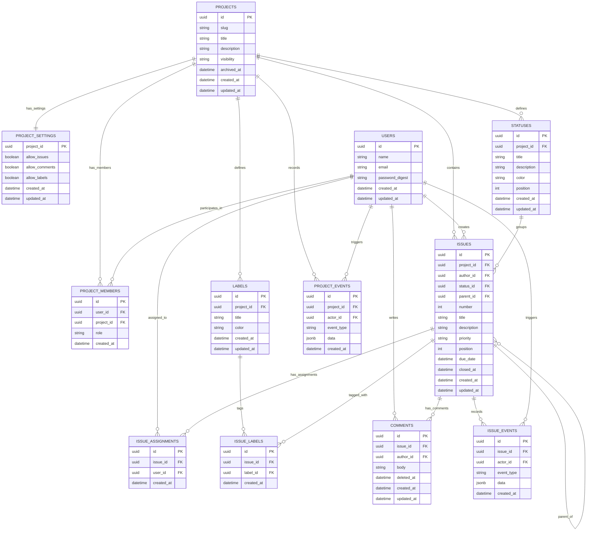

```mermaid
erDiagram
%% Core
  PROJECTS ||--|| PROJECT_SETTINGS : has_settings
  PROJECTS ||--o{ PROJECT_MEMBERS : has_members
  USERS ||--o{ PROJECT_MEMBERS : participates_in

  %% Project structure
  PROJECTS ||--o{ STATUSES : defines
  PROJECTS ||--o{ ISSUES : contains
  USERS ||--o{ ISSUES : creates
  STATUSES ||--o{ ISSUES : groups
  ISSUES ||--o{ ISSUES : parent_of

  %% Assignments
  USERS ||--o{ ISSUE_ASSIGNMENTS : assigned_to
  ISSUES ||--o{ ISSUE_ASSIGNMENTS : has_assignments

  %% Labels
  PROJECTS ||--o{ LABELS : defines
  LABELS ||--o{ ISSUE_LABELS : tags
  ISSUES ||--o{ ISSUE_LABELS : tagged_with

  %% Comments
  USERS ||--o{ COMMENTS : writes
  ISSUES ||--o{ COMMENTS : has_comments

  %% Events
  PROJECTS ||--o{ PROJECT_EVENTS : records
  USERS ||--o{ PROJECT_EVENTS : triggers
  ISSUES ||--o{ ISSUE_EVENTS : records
  USERS ||--o{ ISSUE_EVENTS : triggers

  USERS {
    uuid id PK
    string name
    string email
    string password_digest
    datetime created_at
    datetime updated_at
  }

  PROJECTS {
    uuid id PK
    string slug
    string title
    string description
    string visibility
    datetime archived_at
    datetime created_at
    datetime updated_at
  }

  PROJECT_SETTINGS {
    uuid project_id PK
    boolean allow_issues
    boolean allow_comments
    boolean allow_labels
    datetime created_at
    datetime updated_at
  }

  PROJECT_EVENTS {
    uuid id PK
    uuid project_id FK
    uuid actor_id FK
    string event_type
    jsonb data
    datetime created_at
  }

  PROJECT_MEMBERS {
    uuid id PK
    uuid user_id FK
    uuid project_id FK
    string role
    datetime created_at
  }

  STATUSES {
    uuid id PK
    uuid project_id FK
    string title
    string description
    string color
    int position
    datetime created_at
    datetime updated_at
  }

  ISSUES {
    uuid id PK
    uuid project_id FK
    uuid author_id FK
    uuid status_id FK
    uuid parent_id FK
    int number
    string title
    string description
    string priority
    int position
    datetime due_date
    datetime closed_at
    datetime created_at
    datetime updated_at
  }

  ISSUE_ASSIGNMENTS {
    uuid id PK
    uuid issue_id FK
    uuid user_id FK
    datetime created_at
  }

  LABELS {
    uuid id PK
    uuid project_id FK
    string title
    string color
    datetime created_at
    datetime updated_at
  }

  ISSUE_LABELS {
    uuid id PK
    uuid issue_id FK
    uuid label_id FK
    datetime created_at
  }

  ISSUE_EVENTS {
    uuid id PK
    uuid issue_id FK
    uuid actor_id FK
    string event_type
    jsonb data
    datetime created_at
  }

  COMMENTS {
    uuid id PK
    uuid issue_id FK
    uuid author_id FK
    string body
    datetime deleted_at
    datetime created_at
    datetime updated_at
  }
```
